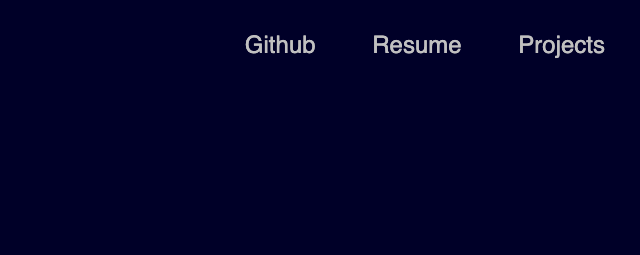
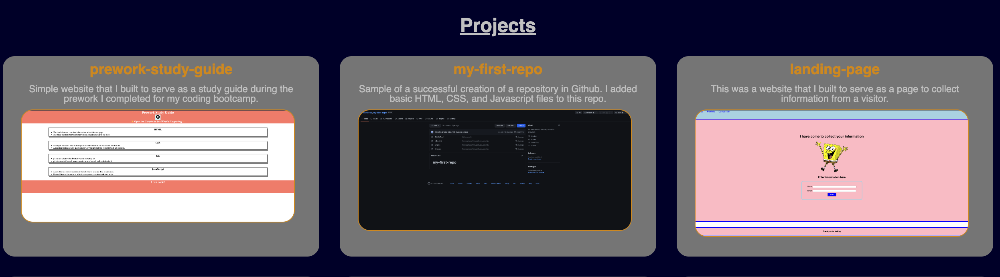
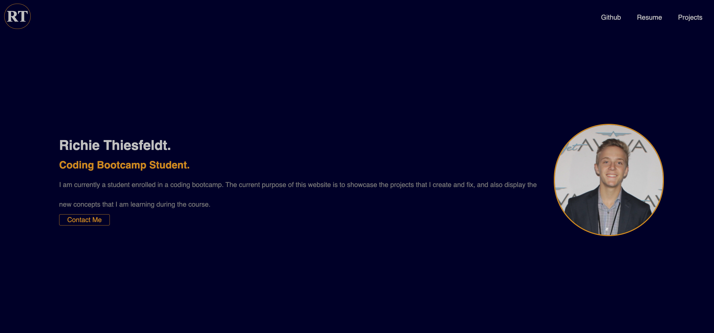

# my-dev-portfolio

## Description

This website was built to display my current knowledge of coding and showcase the projects that I have completed so far in my coding bootcamp.

This will allow other developers, teachers and potentially future employers to see the type of work I have completed already in my career.

In building this website, I learned a lot about both HTML and CSS work together to build a functional and professional looking website.

This screenshot shows the links that I made at the top of my portfolio website. When I hover over these links, they will change color. They also will take me or a user on the appropriate path to what the title states the link is for.

This next screenshot shows a snapshot of the project section of my website. When a user hovers over the images of the different projects, they will be prompted to click the image which serves as a link to that project's website. The prompt that directs the user to click is the image will enlarge once the mouse hovers over it.

This final image shows the home screen of my developer portfolio website when a user first renders it.
